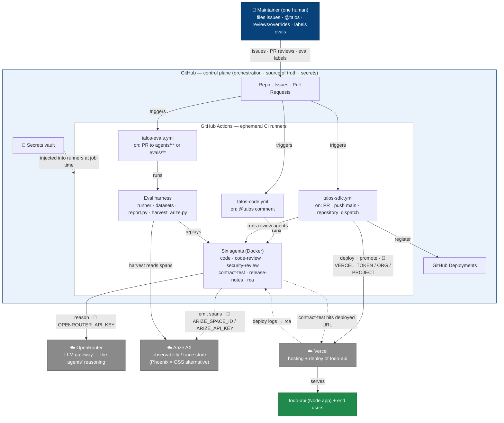

# Talos — system context (platform view)

A C4 "level 1" system-context diagram of the Talos dark-factory SDLC, drawn
through a **platform lens**: where code runs, which external services it depends
on, where secrets live, and how each dependency fails. Grounded in the actual
`.github/workflows/` and the secrets they reference.

## Key flows (what triggers what)

1. **Build** — maintainer comments `@talos` on an issue → `talos-code.yml` → the
   **code** agent (Docker) reasons via **OpenRouter**, opens a PR, and emits
   traces to **Arize**.
2. **Review & ship** — PR opened (or `repository_dispatch: talos-pr-ready`) →
   `talos-sdlc.yml` → **code-review + security-review** agents → tests → **deploy
   a preview to Vercel** → smoke test → auto-merge gate → on merge to `main`,
   **promote to Vercel production** and register a **GitHub Deployment**.
3. **Self-test** — PR touching `agents/**` or `evals/**` → `talos-evals.yml` →
   the **eval harness** replays the affected agent (plus the base-branch baseline
   run) and posts the Δ-vs-base results comment.
4. **Operate** — after deploy, **rca** reads Vercel logs and may open issues;
   **contract-test** hits the deployed URL.
5. **Flywheel** — every agent streams spans to **Arize**; `harvest_arize.py`
   reads them back into new eval tasks (EVAL_STRATEGY.md §3.5).

## Platform concerns at a glance

| Dependency | Role / plane | Auth (in 🔐 GitHub Secrets) | If it fails… |
|---|---|---|---|
| **GitHub Actions** | Control plane — orchestrates everything | `GITHUB_TOKEN`, `TALOS_CI_TOKEN` | nothing runs; the pipeline stalls |
| **OpenRouter** | LLM gateway — the agents' reasoning | `OPENROUTER_API_KEY` | agents can't think → trial raises `InfraFailure` → eval **skips** (never an agent fail) |
| **Arize AX** | Observability — trace store + harvest source | `ARIZE_SPACE_ID`, `ARIZE_API_KEY` (`PHOENIX_URL` alt) | agents still run (tracing is best-effort); harvest produces no new tasks |
| **Vercel** | Hosting/deploy of the product | `VERCEL_TOKEN`, `VERCEL_ORG_ID`, `VERCEL_PROJECT_ID` | no preview/prod deploy; smoke + rca lose their target |
| **Docker** | Packaging — agents run as images | — (built on the runner) | image build/pull flake = `InfraFailure` (EVAL_BACKLOG harness-failure log #4) |

Three platform principles that shaped the design:

- **Trust boundary** — all credentials live in one place (GitHub's Secrets
  vault), are injected into ephemeral runners at job time, and reach the external
  SaaS over the network. The runners are throwaway; nothing persistent holds a
  secret.
- **Infra-failure vs agent-failure split** — every external dependency can fail
  for reasons unrelated to AI quality. The harness distinguishes "the platform
  broke" (→ **skip**, don't penalise the agent) from "the agent gave a bad
  answer" (→ **fail**). That distinction is the backbone of trustworthy metrics
  here (see `evals/runner.py` `INFRA_PATTERNS`).
- **Cost lever** — OpenRouter usage is the main running cost (the "cost per PR"
  metric), and it roughly **doubles** on eval PRs now that the per-PR comment
  runs a base-branch baseline for the Δ-vs-base view.

---

**Related:** [`EVAL_STRATEGY.md`](./EVAL_STRATEGY.md) (how the agents are graded)
· [`EVAL_BACKLOG.md`](./EVAL_BACKLOG.md) (dataset harvest + harness-failure log)
· [`GLOSSARY.md`](./GLOSSARY.md)
