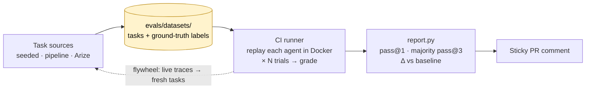
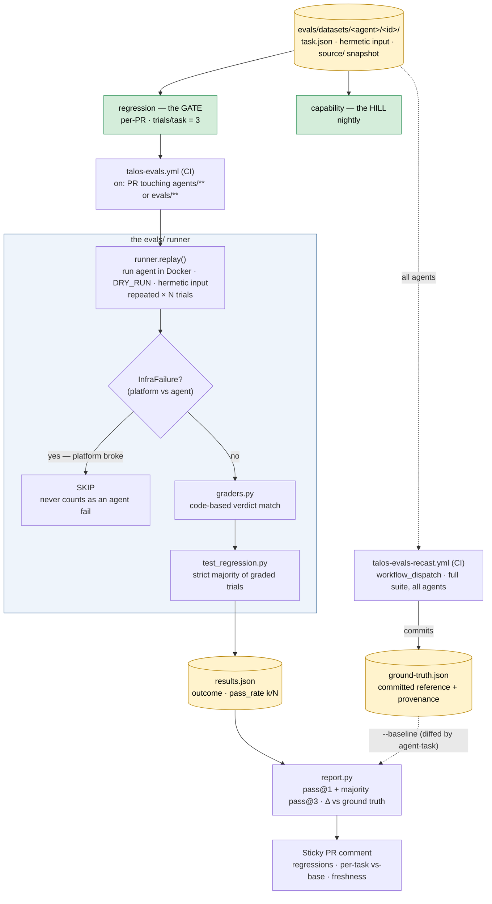

# Talos — evaluation architecture

How the eval system actually works end to end: where tasks come from, how a run
is executed and graded, and how the result becomes a per-PR signal. This is the
"bring it to life" companion to [`EVAL_STRATEGY.md`](./EVAL_STRATEGY.md) (the
why) and [`ARCHITECTURE.md`](./ARCHITECTURE.md) (the platform).

## 1 · The big picture

The whole system in one loop: tasks are collected, run on every PR, and turned
into a signal — and real runs feed new tasks back in (the flywheel).

## 2 · Execution detail

How a PR run actually executes and grades, and how the committed baseline (a
separate manual job) gives the report something to diff against.

## Reading the diagram

1. **Task sources** — every eval task lands in `evals/datasets/<agent>/<id>/`
   the same way regardless of origin: *seeded* (a planted flaw on a fixture
   branch), *pipeline-harvested* (a real `@talos` run captured with its known
   ground truth), or *Arize-harvested* (`harvest_arize.py` turning live traces
   into draft tasks). The maintainer supplies the one thing a machine can't — the
   ground-truth label.
2. **Two suites** — the *same* tasks are read two ways: the **regression** suite
   is the gate that runs on every PR at 3 trials/task; the **capability** suite
   is the nightly hill being climbed. Tasks graduate capability → regression once
   solved reliably.
3. **Execution** — CI discovers the affected suite, then `runner.replay()` runs
   each agent **in Docker with `DRY_RUN`** (no real comments/issues/deploys) on
   the task's hermetic input, repeated for N trials. The key fork is
   **InfraFailure**: a run that broke for platform reasons (network, model
   outage, docker flake) is **skipped**, never scored against the agent. Surviving
   runs are graded by a deterministic **code-based grader**, and the task passes
   on a **strict majority** of its graded trials.
4. **Results → report** — outcomes are written to `results.json`, and `report.py`
   renders the per-PR comment: per-category, both **pass@1** (trial-level) and
   **majority pass@3** (task-level), and the **Δ vs the committed ground-truth
   baseline** (`evals/.baselines/ground-truth.json`) with a regressions callout.
   The baseline is **not** recomputed per-PR — it's a committed snapshot diffed by
   `(agent, task)`, so a PR only has to test the change, not re-test its base. Its
   `.meta.json` provenance (cast date, commit, trials) is surfaced in the comment
   so reviewers can judge freshness; once it drifts from the live grader/model,
   the Δ reads as indicative.
5. **Re-casting the baseline** — `talos-evals-recast.yml` is a manual
   (`workflow_dispatch`) job that re-runs the **full suite across all agents** and
   commits the result as the new ground truth. This decouples *establishing the
   reference* (deliberate, occasional) from *measuring a change* (every PR), and
   replaces the old per-PR base re-run that cost ~2× the work. Trade-off: that
   back-to-back base run controlled for model/grader drift; re-casting often
   enough keeps the drift small, and the comment's freshness line makes staleness
   visible.
6. **The flywheel** — while running, agents emit traces to Arize; `harvest_arize.py`
   feeds those back in as new tasks, so the suite grows from real usage.

## The one rule that makes the numbers trustworthy

Everything hinges on the **infra-failure vs agent-failure split** (the `infra?`
diamond). A green dashboard is only meaningful if "the platform broke" can never
masquerade as "the agent passed" — or vice versa. The runner enforces this in
code (`evals/runner.py` `INFRA_PATTERNS` → pytest skip), which is why the eval
results can be used as a real quality gate rather than noise.

---

**Related:** [`EVAL_STRATEGY.md`](./EVAL_STRATEGY.md) ·
[`EVAL_BACKLOG.md`](./EVAL_BACKLOG.md) · [`ARCHITECTURE.md`](./ARCHITECTURE.md)
